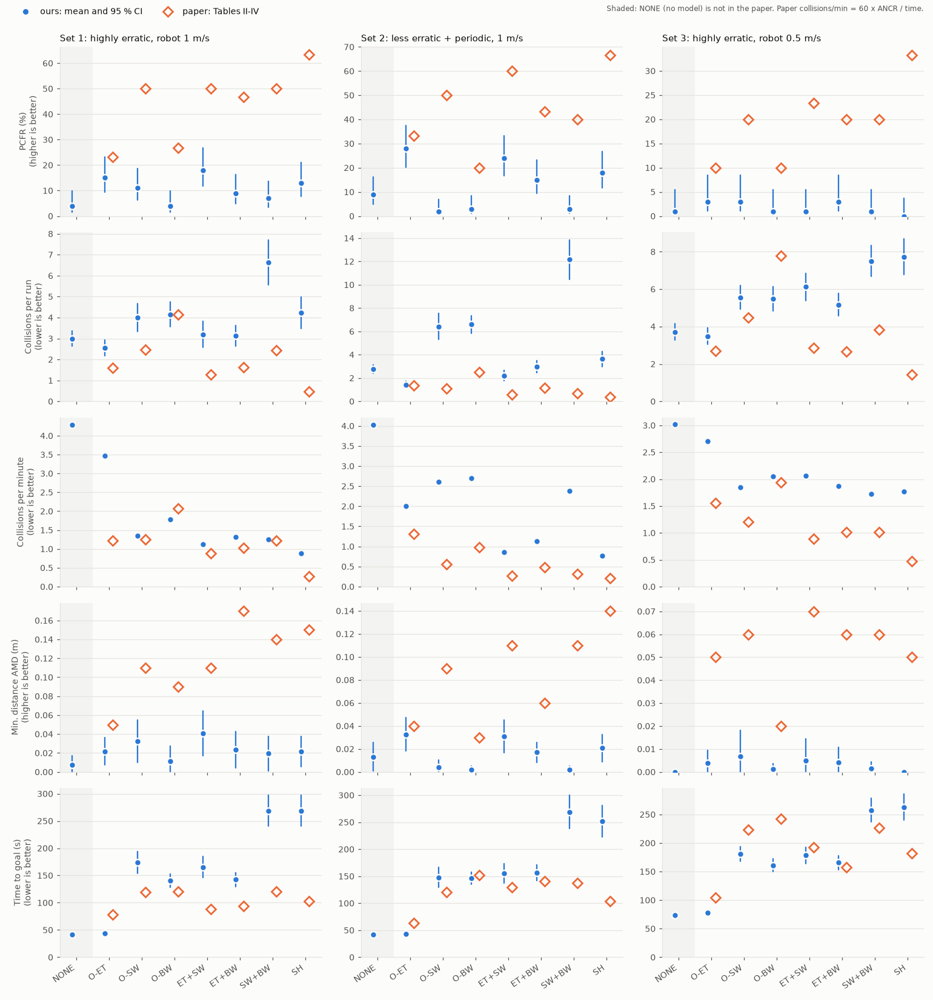

# Safety Hierarchy planner: C++ replication

Replication of

> B. L'Espérance and K. Gupta, "Safety Hierarchy for Planning With Time
> Constraints in Unknown Dynamic Environments," *IEEE Transactions on
> Robotics*, 30(6):1398-1411, 2014. doi:10.1109/TRO.2014.2354933

in dependency-free C++17: the three models of the future (BW, SW, ET), the
composite costmap (Algorithm 1, Eqs. 4-7), the plan/execute timing of
Sec. IV, the exhaustive planner of Sec. V-B, the nine algorithms, the five
maps and the three simulation sets of Sec. VI, and the statistics used for
Tables II-IV.

* `docs/DESIGN.md` – file layout, equation-to-code mapping, and **every
  assumption** made where the paper is silent (A1-A25, H1).
* `results/` – raw CSVs of the experiments and the generated tables.

## Build and test

```bash
cmake -S . -B build -DCMAKE_BUILD_TYPE=Release
cmake --build build -j
./build/sh_tests          # 30 unit tests (also: ctest --test-dir build)
```

Requires only a C++17 compiler and CMake >= 3.16. The optional Python tools
need matplotlib (plotting) or PyMuPDF/Pillow/SciPy (map digitizing).

## Run

```bash
# one scenario, one algorithm; per-cycle log and costmap images
./build/sh_run --set 1 --map 2 --run 0 --algo SH --verbose \
               --dump-dir /tmp/cm --dump-every 5 --trace /tmp/trace.csv
python3 tools/plot_run.py /tmp/trace.csv maps/map2.txt /tmp/run.png --goal X Y

# the paper's experiment: 3 sets x 5 maps x 6 runs x 9 algorithms = 810 runs
./build/sh_experiments --out results/results_default.csv
./build/sh_tables results/results_default.csv      # Tables II-IV, ours / paper
```

Algorithms: `PF-ET F-ET SH O-ET O-SW O-BW ET+SW ET+BW SW+BW`.
Options: `--runs N` (runs per map), `--sets`, `--maps`, `--algos`,
`--threads`, `--bw-latency` (A18), `--bw-endpoints` (hypothesis H1).

Costmap images (`--dump-dir`) show, for slices k = 0, m/2, m: known static
(black), inflated static (grey), visible area (cream), BW (light blue),
SW (blue), ET (red), true obstacles at the sensing time (green), and the
chosen trajectory (magenta).

## The costmap, as implemented

| paper | code |
|---|---|
| SCM = NF1 on the sensed static map (unknown = free, obstacles inflated, -1, L1 wavefront) | `src/nf1.cpp` |
| Eq. (5) `c_bw = m (nf_max - nf_min) + 1` | `cost_constants()` in `src/costmap.cpp` |
| Eq. (6) `c_sw = m (nf_max + c_bw - nf_min) + 1` | same |
| Eq. (7) `c_et = m (nf_max + c_sw - nf_min) + 1` | same |
| Algorithm 1: DCM(x,y,t) = SCM, `+= c_bw / c_sw / c_et` on BW / SW / ET cells | `DynamicCostmap::build()` |
| BW, SW: robot-radius inflation at the first slice, growth at v_omax, not through static obstacles | `src/distance_field.cpp` |
| Eq. (4): end-point value if the trajectory is in F, else the sum over the m samples | `evaluate_trajectory()` |
| window = max(s_r, Delta_p v_rmax) around the robot, dt = min(dr/v_rmax, dr/v_omax) | `Params::window_half_cells()`, test `table1_parameters_are_consistent` |

`tests/test_costmap.cpp` checks Eqs. (5)-(7) literally. It checks that the
Eq. (4) argmin selects the trajectory the safety hierarchy prescribes (on
random and adversarial cases), and it checks the Algorithm 1 invariants on
real built costmaps: every DCM value equals SCM plus the constants of the
models the cell belongs to, SW ⊆ BW, and grown sets never shrink over time.
Re-deriving the Proposition exposed two conditions the paper leaves
implicit; both are tested and explained in `docs/DESIGN.md`:

1. the lower branch of Eq. (4) must sum exactly **m** samples (k = 1..m);
   with m+1 terms, Case 3 of the proof can fail;
2. Eq. (7) is sufficient only when the models are nested (ET ⊆ SW ⊆ BW).
   Every planning cycle therefore compares the Eq. (4) choice with a direct
   lexicographic implementation of the hierarchy and counts disagreements
   ("SH violations" in the tables).

The p-values use a one-sided, unpooled two-sample z-test. For PCFR this
reproduces the paper's p-values to four decimals (10 cases in
`tests/test_stats.cpp`), whereas the pooled test does not.

## Results

All numbers below: 3 sets x 5 maps x 6 runs x 9 algorithms = 810 runs, as in
the paper (30 runs per algorithm and set). Full tables with p-values,
per-map breakdowns and diagnostics: `results/tables_default.md`; raw data:
`results/results_default.csv`. Regenerate with the commands above (~25 min
on 4 cores).

### Summary: ours vs paper (PCFR % / ANCR / time to goal s)

| set | algorithm | ours | paper |
|---|---|---|---|
| 1 | PF-ET | 96.7 / 0.03 / 42 | 93.3 / 0.07 / 44 |
| 1 | F-ET  | 26.7 / 1.70 / 44 | 33.3 / 1.10 / 55 |
| 1 | O-ET  | 10.0 / 2.73 / 45 | 23.3 / 1.59 / 78 |
| 1 | **SH** | **10.0 / 3.80 / 223** | **63.3 / 0.47 / 103** |
| 2 | PF-ET | 100.0 / 0.00 / 41 | 96.7 / 0.03 / 44 |
| 2 | F-ET  | 63.3 / 0.67 / 41 | 40.0 / 1.07 / 45 |
| 2 | O-ET  | 26.7 / 1.33 / 43 | 33.3 / 1.38 / 63 |
| 2 | **SH** | **16.7 / 3.63 / 277** | **66.7 / 0.37 / 104** |
| 3 | PF-ET | 63.3 / 0.43 / 80 | 93.3 / 0.07 / 94 |
| 3 | F-ET  | 13.3 / 2.77 / 78 | 30.0 / 1.63 / 79 |
| 3 | **SH** | **0.0 / 8.67 / 261** | **33.3 / 1.43 / 182** |

### What reproduces

* **The benchmark and the ET-only planners.** PF-ET (perfect sensing and
  future) matches the paper in sets 1-2 on every measure (PCFR, ANCR, AMD
  0.07/0.06 m vs 0.09/0.08 m, time). F-ET and O-ET are in the paper's
  range. So the simulated world, the sensing/estimation pipeline, the
  timing model (Delta_e latency) and the exhaustive planner behave like
  the paper's.
* **The costmap equations.** Eqs. (4)-(7) and Algorithm 1 are implemented
  as printed and verified by tests. The Eq. (4) choice agreed with a direct
  implementation of the hierarchy steps in **every** planning cycle of all
  810 runs (0 "SH violations").
* **The hierarchy's intended effect, per unit time.** SH collides less per
  minute than F-ET (set 1: 1.0 vs 2.3 collisions/min), and on the empty
  map SH takes about 3x F-ET's time (paper: about 2x over all maps).

### What does not reproduce

* **The paper's main claim:** SH is not safer than F-ET per run in our
  simulation (PCFR 10 % vs 27 %, ANCR 3.8 vs 1.7 in set 1). Every
  algorithm that uses SW or BW is 3-7x slower than F-ET (paper: about 2x),
  and because obstacles never avoid the robot, the longer exposure turns
  the per-minute safety gain into more collisions per run.
* **Why they are slow:** SH triggers the Sec. VII-A static-deadlock fix
  13.7 times per run in set 1. The paper reports the robot got stuck 12
  times in 90 SH runs. Per map, SH is slowest in clutter (maps 2-5:
  220-320 s) and closest to the paper on the empty map 1 (93 s).
  Collision classification (set 1, 114 SH collisions): 2 on trajectories
  scored collision-free, 57 on ET-free plans made 0.8-1.6 s earlier (an
  erratic obstacle turned), and 55 in situations with no ET-free
  trajectory at all. No implementation error is visible in these; they
  are consequences of the models as specified plus the long exposure.
* **Where BW gets restrictive:** the BW model seeds a wavefront at every
  FOV boundary, including the shadow edges behind static obstacles.
  Figs. 1-2 show exactly this, and the implementation follows them
  (`tools/plot_run.py` and `--dump-dir` images show the robot retreating
  into corners, away from shadow edges, as Sec. VII predicts). With
  obstacles 2-5 m apart, and BW growing 2.5 m in 3 s, few trajectories are
  BW-free in maps 2-5.
* **Hypothesis H1** (option `--bw-endpoints`, not the paper's method): seed
  BW only at the scan's max-range end points. It halves the deadlock
  fixes and brings SH's time close to the paper in sets 2-3 (151 s vs
  104 s; 170 s vs 182 s), but SH still collides 4-7x more than in the
  paper (`results/tables_h1_endpoints.md`). So the static-shadow part of
  BW explains part of the time gap, and none of the safety gap.

### Ablation: BW, SW, ET and their combinations

All 7 combinations of the three models (the paper's six variants and SH),
plus **NONE** (no model, NF1 only; not in the paper) to complete the 2^3
design. 3 sets x 5 maps x **20 runs** = 100 runs per combination and set
(2400 runs), Delta_e = 0.8 s, deadlock fix active whenever BW is. The first 6
runs per map are the paper's design (n = 30); they reproduce the 810-run
experiment exactly (630 of 630 runs identical). 0 hierarchy violations.

```bash
./build/sh_experiments --runs 20 --algos NONE,O-ET,O-SW,O-BW,ET+SW,ET+BW,SW+BW,SH --out results/ablation.csv
./build/sh_ablation results/ablation.csv --summary results/ablation_summary.csv > results/ablation_tables.md
python3 tools/plot_ablation.py results/ablation_summary.csv results/ablation.png
```

`results/ablation_tables.md` has every number: PCFR, ANCR, AMD and time
(ours with 95 % CIs, ours for the paper's design, paper), goal-reached
rate, collisions per minute, deadlock fixes, planning time, the paper's
p-values, rank agreement, main effects and the paper's claims.



**Main effect of adding one model** (mean change over the 3 combination
pairs that exist in the paper; ours / paper):

| model added | collisions per minute | time to goal (s) | collisions per run | PCFR (pp) |
|---|---|---|---|---|
| BW, set 1/2/3 | -0.83 / -0.28, -0.39 / -0.38, -0.42 / -0.38 | +99 / +11, +110 / +23, +83 / +15 | +1.4 / -0.3, +2.9 / -0.3, +1.7 / -0.7 | -5 / +12, -6 / +2, -1 / +7 |
| SW, set 1/2/3 | -1.10 / -0.65, -0.61 / -0.66, -0.36 / -0.71 | +126 / +7, +110 / +5, +98 / +32 | +1.4 / -1.1, +2.3 / -1.1, +2.4 / -1.7 | +3 / +22, 0 / +23, -2 / +12 |
| ET, set 1/2/3 | -0.35 / -0.78, -1.65 / -0.29, +0.03 / -0.59 | -2 / -25, 0 / -11, +3 / -53 | -1.4 / -1.9, -5.5 / -0.7, +0.2 / -3.1 | +6 / +11, +16 / +20, 0 / +9 |

(Paper collisions per minute = 60 x ANCR / time, derived from Tables II-IV.)

What the ablation shows:

1. **Per minute of exposure, the models work as in the paper.** Each of BW,
   SW and ET lowers the collision rate. For BW and SW the size of the
   reduction is close to the paper's (e.g. adding BW: -0.39 vs -0.38 /min
   in set 2, -0.42 vs -0.38 in set 3). Our ordering of the 7 combinations
   by collisions per minute agrees with the paper's (Spearman +0.86,
   +0.71, +0.36 in sets 1-3), and **SH has the lowest collision rate of
   the 7 in sets 1 and 2, as in the paper**.
2. **The time cost does not reproduce.** Adding SW or BW costs +83 to
   +126 s in our simulation, against +5 to +32 s in the paper. BW
   combinations trigger the deadlock fix 6-21 times per run, and all but
   2 of the 45 runs that hit the 600 s limit are SW+BW or SH.
3. **Hence the per-run measures diverge.** Obstacles never avoid the
   robot, so collisions per run = rate x exposure. The lower rate does
   not compensate the 2-3x longer runs. Adding SW or BW *raises* collisions
   per run (+1.4 to +2.9) and changes PCFR by -6 to +3 pp; the paper reports the
   opposite. Rank agreement with the paper on PCFR and ANCR is about zero
   (-0.55 to +0.19).
4. **ET is the one model whose per-run effect matches the paper** in sets
   1-2 (PCFR +6 / +16 pp vs +11 / +20; fewer collisions per run). It costs
   no time in either. In set 3 (slow robot) it has no effect in our
   simulation.
5. **The paper's ablation claims:** SH is significantly better (p < 0.05,
   the paper's test) than 2, 3 and 0 of the 6 variants in sets 1-3 (paper:
   6, 5, 6). The highest PCFR and lowest collisions per run of the 7 are
   O-ET or ET+SW, never SH (paper: SH in every set). ET+SW is at least as
   good as SH in all three sets (paper: comparable only in set 2).
6. **Absolute levels.** The collision rates of the ET-based combinations
   are 1.3-3.8x the paper's (O-ET, set 1: 3.5 vs 1.2 per minute; SH: 3.3-3.8x). Most runs
   contain at least one collision, so AMD (0 for such runs) is near 0
   everywhere.

Two gaps remain: why SW and BW cost about 100 s here but 10-30 s in the
paper, and why the ET planners collide more often per minute. The paper
does not specify the obstacle speed distribution (we use a constant
v_omax = 0.75 m/s, A9), which acts on both, so it is the first thing to test.

### Implementation bugs found by these experiments (all fixed, with regression tests)

1. BW/SW/ET cell membership used the cell *centre*. A robot centre
   elsewhere in a "free" cell could then be ~7 cm too close: all 21 PF-ET
   collisions in set 1 were such grazes. With the cell-overlap convention:
   1 (DESIGN.md A23).
2. The predicted start pose ignored stalls, and the "no static-free
   trajectory" fallback judged walls by the robot's centre cell. Together
   they made a robot touching a wall re-plan into it forever (3 timeouts)
   (A24, A25).

### Most likely sources of the remaining gap (not specified by the paper)

Obstacle speed distribution (we use a constant 0.75 m/s), obstacle count
in sets 1 and 3 (we use 25), robot and obstacle radius (0.25 m each),
start/goal placement, the obstacles' avoidance manoeuvre, and how the
authors' code derived the FOV boundary from the laser scan (H1). None of
these was tuned. `docs/DESIGN.md` lists every such choice.

